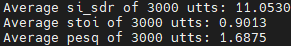

# Domain-invariant Pretrained(DIP) frontend
The official Domain-invariant Pretrained(DIP) frontend implementation based on fairseq and the pretrained checkpoint as mentioned in System.13.  
Our paper link is availiable(https://ieeexplore.ieee.org/document/10640238)  
The checkpoint of pretrained frontend is avaliable(https://drive.google.com/file/d/15_YZAF1MJs4VybuYM2FSsLQau_I0qir-/view?usp=drive_link)  

##### Data preparing
To papare the multiple domain data, an example is in dataset/PT_vox2k_full:
1. train_source.tsv, valid_target.tsv are required for source domain synthetic mixture;
2. train_target.tsv, valide_target.tsv are required for target domain real mixture;
The label of mixture is not needed;

#### pretrain model
To pretrain the DIP model, using run.sh;

#### train separator
Our DIP frontend is suitable for both time-domain and frequency domain separator:

1. For frequency domain separator, S3prl toolkit is recommanded;  
   Please replace the original s3pel/upstream/expert.py to our version.The test results on Libri2Mix should be about 11dB:  
     
   For test results on Vox2Mix test set, please refer to the paper.  
   
3. For time domain separator, asteroid toolkit is recommanded;  
   For test results on Vox2Mix, LRS2Mix and Real-M test set, please refer to the paper.   

We have not checked the correctness of all scripts. Please do neccessary modification for your pretraining and training process. We will update the script for both frontend pretraining and separator training later.     

### License
The code and models in this repository are licensed under the [GNU General Public License v3](https://www.gnu.org/licenses/gpl-3.0.en.html) for academic and other non-commercial uses. For commercial use, the enquirers will require a license from us or sublicense from a collaborated company if the company decides on an exclusive license for the invention.

Please contact:
- e0125301@u.nus.edu
